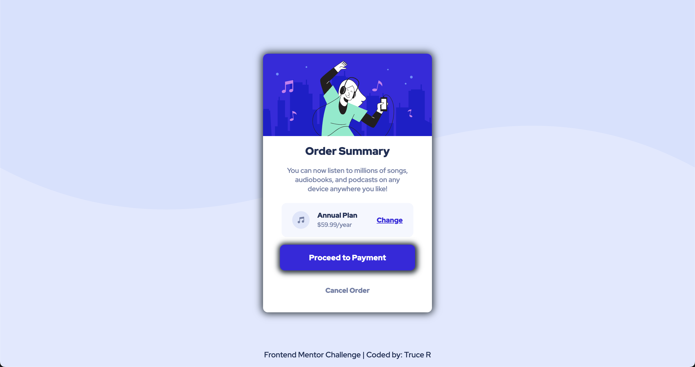

# Frontend Mentor - Order summary card solution

This is a solution to the [Order summary card challenge on Frontend Mentor](https://www.frontendmentor.io/challenges/order-summary-component-QlPmajDUj). Frontend Mentor challenges help you improve your coding skills by building realistic projects.

## Table of contents

- [Overview](#overview)
  - [The challenge](#the-challenge)
  - [Screenshot](#screenshot)
  - [Links](#links)
- [My process](#my-process)
  - [Built with](#built-with)
  - [What I learned](#what-i-learned)
  - [Continued development](#continued-development)
- [Author](#author)

## Overview

### The challenge

Users should be able to:

- See hover states for interactive elements

### Screenshot



### Links

- Solution URL: [GitHub Repo](https://github.com/DevTruce/order-summary)
- Live Site URL: [Live Site](https://devtruce.github.io/order-summary/)

## My process

My process was simple, I used flex box to get my elements positioned.

the main container is a column to allow for positioning of elements vertically
and the pricing panel is set as a row to allow for positioning horizontally.
The main container is set to a width of 350px as this I felt was close to the example and for screen sizes under 350px the panel drops to 250px pixels. the footers is fixed to the bottom

### Built with

- HTML5
- CSS3
- Flexbox

### What I learned

During this challenge I learned to better use flexbox, units & how I can better position elements to allow them to adapt well with multiple screen sizes.

```html
<section class="pricing-panel">
  
  <span>Annual Plan <br /><span>$59.99/year</span></span>

  <a href="#">Change</a>
</section>
```

```css
body {
  min-height: 100vh;
  display: flex;
  flex-direction: column;
  align-items: center;
  justify-content: space-evenly;
  background-image: url(images/pattern-background-mobile.svg);
  background-repeat: no-repeat;
  background-size: 100%;
  box-sizing: border-box;
  background-color: hsl(225, 100%, 94%);
}

.card-container {
  display: flex;
  flex-direction: column;
  align-items: center;
  background-color: white;
  /* width: 80%; */
  max-height: 100%;
  width: 350px;
  margin: 0 2rem 0 2rem;
  /* border: 1px solid red; */
  border-radius: 10px;
  padding-bottom: 1rem;
  box-shadow: 0 0 15px 3px #2e3840;
}

.pricing-panel {
  display: flex;
  align-items: center;
  justify-content: center;
  background-color: hsl(225, 100%, 98%);
  border-radius: 10px;
  padding: 1rem;
  max-width: 70%;
}

.pricing-panel > span > span {
  /* padding: 0 1rem 0 1rem; */
  color: hsl(224, 23%, 55%);
  line-height: 1.5;
  font-size: 0.8rem;
}

.pricing-panel > span {
  text-align: left;
  font-weight: 900;
  font-size: 0.9rem;
}

.pricing-panel a {
  padding: 0 0 0 2.5rem;
  font-size: 0.9rem;
}

.pricing-panel a:hover,
.pricing-panel a:focus {
  cursor: pointer;
  color: mediumslateblue;
  text-decoration: none;
  transition: text-decoration, background-color 250ms ease-in-out;
}

.pricing-panel > a {
  color: hsl(245, 75%, 52%);
  text-decoration: underline;
  font-weight: 900;
}

.footer-text {
  position: fixed;
  bottom: 0;
  padding-bottom: 15px;
}

.footer-text a:hover,
.footer-text a:focus {
  cursor: pointer;
  font-size: 1.25rem;
  transition: color, font-size 250ms ease-in-out;
  transform: translate(100px, 100px);
}
```

### Continued development

My focus is still heavily into flexbox, units and positioning my elements better for responsive layouts. I am trying to figure how I can go about creating a truly responsive element that
keeps its elements contained while sizing up/down extremely!

## Author

- Frontend Mentor - [@DevTruce](https://www.frontendmentor.io/profile/DevTruce)
