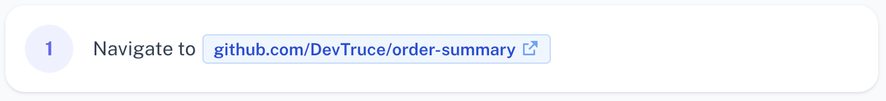
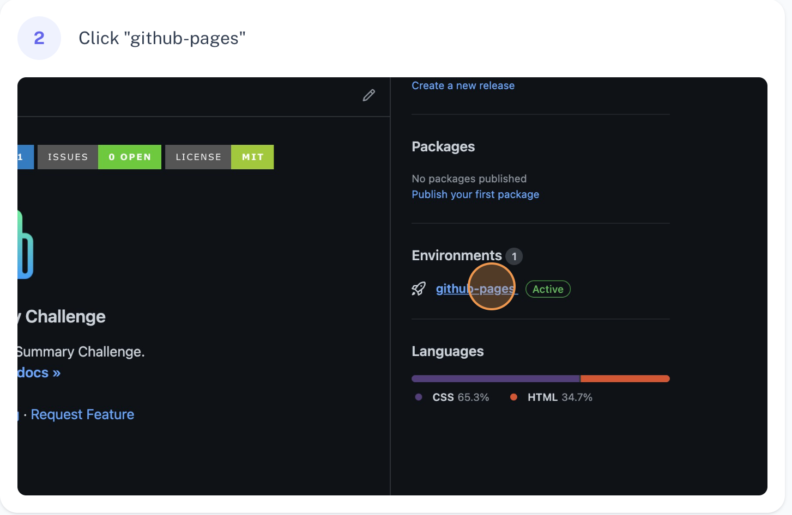
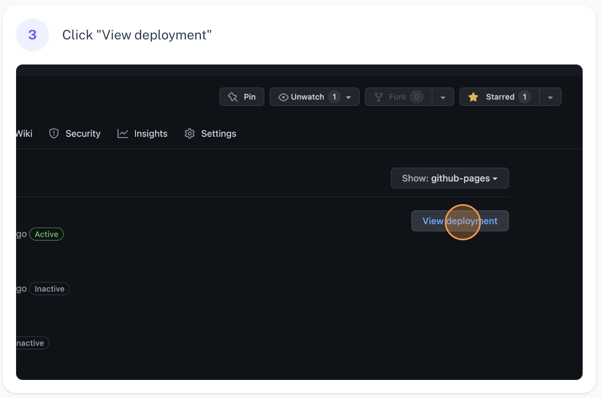

[![Contributors][contributors-icon]][contributors-link]
[![Forks][forks-icon]][forks-link]
[![Stargazers][stars-icon]][stars-link]
[![Issues][issues-icon]][issues-link]
[![MIT License][license-icon]][license-link]

<!-- PROJECT LOGO -->
 

  

<h3 align="center">Order Summary Challenge</h3>

  

    Frontend Mentor - Order Summary Challenge.
     
    <a href="https://github.com/DevTruce/order-summary" target="_blank"><strong>Explore the docs »</strong></a>
     
     
    <a href="https://devtruce.github.io/order-summary/" target="_blank">View Demo</a>
    ·
    <a href="https://github.com/DevTruce/order-summary/issues" target="_blank">Report Bug</a>
    ·
    <a href="https://github.com/DevTruce/order-summary/issues" target="_blank">Request Feature</a>
  

<!-- TABLE OF CONTENTS -->

  
Table of Contents

  <ol>
    <li>
      <a href="#about-the-project">About The Project</a>
      <ul>
        <li><a href="#built-with">Built With</a></li>
      </ul>
    </li>
    <li>
      <a href="#getting-started">Getting Started</a>
      <ul>
        <li><a href="#prerequisites">Prerequisites</a></li>
      </ul>
    </li>
    <li><a href="#usage">Usage</a></li>
    <li><a href="#contributing">Contributing</a></li>
    <li><a href="#license">License</a></li>
    <li><a href="#contact">Contact</a></li>
    <li><a href="#acknowledgments">Acknowledgments</a></li>

  </ol>

<!-- ABOUT THE PROJECT -->

## About The Project

[![Product Name Screen Shot][product-screenshot]](product-link)

This project is a challenge created by frontend mentor and coded by me.
The goal is to build a responsive webpage based on the images/designs they provide.
This particular challenge has you building a very nice order summary panel. There is some nice styles in my opinion and simple hover effects. Hovering some select elements in the footer, "change, "proceed to pay" & "cancel order" all have set hover effects as well as if you hover over the image I added a simple `transform: scale(1.2)` hover effect that turned out nice imo.

(<a href="#readme-top">back to top</a>)

### Built With

- [![HTML5][html5-icon]][html5-link]
- [![CSS3][css3-icon]][css3-link]
- [![Flexbox][flexbox-icon]][flexbox-link]

(<a href="#readme-top">back to top</a>)

<!-- GETTING STARTED -->

## Getting Started

[View Demo](https://devtruce.github.io/order-summary/)

### Prerequisites

- Mobile Phone / Desktop / Tablet
- Internet

<!-- USAGE EXAMPLES -->

## Usage

You can use this project for anything if you would like, It was completed as a code challenge and I might add onto it in the future.

(<a href="#readme-top">back to top</a>)

<!-- CONTRIBUTING -->

## Contributing

Contributions are what make the open source community such an amazing place to learn, inspire, and create. Any contributions you make are **greatly appreciated**.

If you have a suggestion that would make this better, please fork the repo and create a pull request. You can also simply open an issue with the tag "enhancement".
Don't forget to give the project a star! Thanks again!

1. Fork the Project
2. Create your Feature Branch (`git checkout -b feature/AmazingFeature`)
3. Commit your Changes (`git commit -m 'Add some AmazingFeature'`)
4. Push to the Branch (`git push origin feature/AmazingFeature`)
5. Open a Pull Request

(<a href="#readme-top">back to top</a>)

<!-- LICENSE -->

## License

Distributed under the MIT License. See `LICENSE.txt` for more information.

(<a href="#readme-top">back to top</a>)

<!-- CONTACT -->

## Contact

Email: [DevTruce@Gmail-icon]()

Discord: [Xzypher#9999]()

Project Link: [QR Code](https://github.com/DevTruce/order-summary)

[![FEM][fem-icon]][fem-link] 
[![Reddit][reddit-icon]][reddit-link]  
[![Twitter][twitter-icon]][twitter-link] 
[![LinkedIn][linkedin-icon]][linkedin-link] 
[![Stackoverflow][stackoverflow-icon]][stackoverflow-link]

(<a href="#readme-top">back to top</a>)

<!-- ACKNOWLEDGMENTS -->

## Acknowledgments

- [MDN Documentation](https://developer.mozilla.org/en-US/)

(<a href="#readme-top">back to top</a>)

<!-- #### MARKDOWN LINKS & IMAGES #### -->

<!-- ## GitHub ##-->
<!-- links -->

[contributors-link]: https://github.com/DevTruce/order-summary/graphs/contributors
[forks-link]: https://github.com/DevTruce/order-summary/network/members
[stars-link]: https://github.com/DevTruce/order-summary/stargazers
[issues-link]: https://github.com/DevTruce/order-summary/issues
[license-link]: https://github.com/DevTruce/order-summary/blob/master/LICENSE.txt

<!-- icons -->

[contributors-icon]: https://img.shields.io/github/contributors/DevTruce/order-summary.svg?style=for-the-badge
[forks-icon]: https://img.shields.io/github/forks/DevTruce/order-summary.svg?style=for-the-badge
[stars-icon]: https://img.shields.io/github/stars/DevTruce/order-summary.svg?style=for-the-badge
[issues-icon]: https://img.shields.io/github/issues/DevTruce/order-summary.svg?style=for-the-badge
[license-icon]: https://img.shields.io/github/license/DevTruce/order-summary.svg?style=for-the-badge

<!-- ## Project ## -->

[product-screenshot]: src/images/screenshot.png
[product-link]: https://LINK-HERE

<!-- ## Socials ## -->
<!-- links -->

[fem-link]: https://www.frontendmentor.io/profile/DevTruce
[stackoverflow-link]: https://stackoverflow-icon/users/16258101/dev-truce
[twitter-link]: https://twitter-icon/DevTruce
[reddit-link]: https://www.reddit-icon/user/DevTruce
[linkedin-link]: https://www.linkedin-icon/in/trucer/

<!-- icons -->

[fem-icon]: https://img.shields.io/badge/fem-20232A?style=for-the-badge&logo=frontendmentor&logoColor=85CDFD
[stackoverflow-icon]: https://img.shields.io/badge/stackoverflow-20232A?style=for-the-badge&logo=stackoverflow&logoColor=orange
[twitter-icon]: https://img.shields.io/badge/twitter-20232A?style=for-the-badge&logo=twitter&logoColor=85CDFD
[reddit-icon]: https://img.shields.io/badge/Reddit-orange?style=for-the-badge&logo=reddit&logoColor=white
[linkedin-icon]: https://img.shields.io/badge/-LinkedIn-black.svg?style=for-the-badge&logo=linkedin&colorB=555

<!-- ## Tech & Tools ## -->
<!-- links -->

[html5-link]: https://html-icon/
[css3-link]: https://css3-icon/
[flexbox-link]: https://developer.mozilla.org/en-US/docs/Learn/CSS/CSS_layout/Flexbox
[grid-link]: https://developer.mozilla.org/en-US/docs/Web/CSS/CSS_Grid_Layout
[bootstrap-link]: https://getbootstrap-icon
[javascript-link]: https://www.javascript-icon/
[reactjs-link]: https://reactjs.org/
[nextjs-link]: https://nextjs.org/
[expressjs-link]: https://expressjs-icon/

<!-- icons -->

[html5-icon]: https://img.shields.io/badge/HTML5-orange?style=for-the-badge&logo=html5&logoColor=white
[css3-icon]: https://img.shields.io/badge/CSS3-blue?style=for-the-badge&logo=CSS3&logoColor=white
[flexbox-icon]: https://img.shields.io/badge/flexbox-blue?style=for-the-badge&logo=CSS3&logoColor=white
[grid-icon]: https://img.shields.io/badge/Grid-blue?style=for-the-badge&logo=CSS3&logoColor=white
[bootstrap-icon]: https://img.shields.io/badge/Bootstrap-563D7C?style=for-the-badge&logo=bootstrap&logoColor=white
[javascript-icon]: https://img.shields.io/badge/Javascript-FCE22A?style=for-the-badge&logo=javascript&logoColor=black
[reactjs-icon]: https://img.shields.io/badge/React-20232A?style=for-the-badge&logo=react&logoColor=61DAFB
[nextjs-icon]: https://img.shields.io/badge/next.js-000000?style=for-the-badge&logo=nextdotjs&logoColor=white
[expressjs-icon]: https://img.shields.io/badge/Express.js-000000?style=for-the-badge&logo=express&logoColor=white
