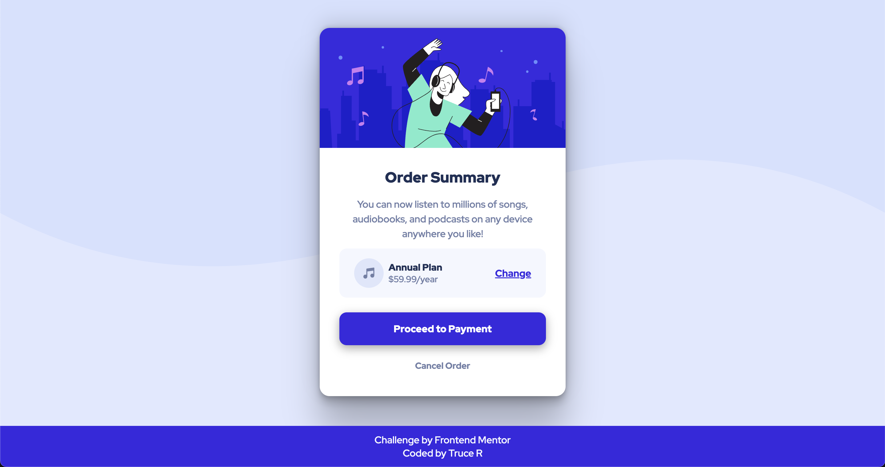

# Frontend Mentor - Order summary card solution

This is a solution to the [Order summary card challenge on Frontend Mentor](https://www.frontendmentor.io/challenges/order-summary-component-QlPmajDUj). Frontend Mentor challenges help you improve your coding skills by building realistic projects.

## Table of contents

- [Overview](#overview)
  - [The challenge](#the-challenge)
  - [Screenshot](#screenshot)
  - [Links](#links)
- [My process](#my-process)
  - [Built with](#built-with)
  - [What I learned](#what-i-learned)
  - [Continued development](#continued-development)
- [Author](#author)

## Overview

### The challenge

Users should be able to:

- See hover states for interactive elements

### Screenshot



### Links

- Solution URL: [FEM Solution](https://www.frontendmentor.io/solutions/order-summary-challenge-html-css-flexbox-9maN1Rzz1P)
- Live Site URL: [Live Site](https://devtruce.github.io/order-summary/)

## My process

My process was simple, I used flex box to get my elements positioned.

the main container is a column to allow for positioning of elements vertically
and the pricing panel is set as a row to allow for positioning horizontally.
The main container is set to a width of 350px as this I felt was close to the example and for screen sizes under 350px the panel drops to 250px pixels. the footers is fixed to the bottom

REWORK:
Second time around and things felt much better for sure, I know I didnt size things the best
but I was not going for exact matches with the rework and more so I was focused on correctly
using flexbox and units.

### Built with

- HTML5
- CSS3
- Flexbox

### What I learned

During this challenge I learned to better use flexbox, units & how I can better position elements to allow them to adapt well with multiple screen sizes.

```html
<picture class="image-container">
  
</picture>

<footer class="page-footer">
  <p>
    Challenge by
    <a class="links" href="https://www.frontendmentor.io/home" target="_blank"
      >Frontend Mentor</a
    >
  </p>
  <p>
    Coded by
    <a class="links" href="https://github.com/DevTruce" target="_blank"
      >Truce R</a
    >
  </p>
</footer>
```

```css
.card-container {
  display: flex;
  flex-direction: column;
  align-items: center;
  background-color: white;
  width: 100%;
  max-width: 22rem;
  border-radius: 1rem;
  overflow: hidden;
  margin: auto 2rem;
  box-shadow: rgba(0, 0, 0, 0.25) 0px 54px 55px, rgba(0, 0, 0, 0.12) 0px -12px 30px,
    rgba(0, 0, 0, 0.12) 0px 4px 6px, rgba(0, 0, 0, 0.17) 0px 12px 13px,
    rgba(0, 0, 0, 0.09) 0px -3px 5px;
}

.image-container {
  width: 100%;
  display: flex;
  align-items: center;
  justify-content: center;
  overflow: hidden;
}

.image {
  width: 100%;
  display: block;
  border-radius: 0.75rem 0.75rem 0 0;
}

.image:hover {
  transform: scale(1.2);
  transition: all 250ms ease-in-out;
}

.order-body {
  padding: 1rem 2rem;
}

.order-header {
  padding: 1rem;
  font-weight: 900;
  font-size: 1.5rem;
  color: var(--dark-blue);
}

.order-text {
  color: var(--desaturated-blue);
  line-height: 1.5;
  padding: 0 0 0.75rem 0;
}

.pricing-container {
  padding: 1rem 1.5rem;
  /* width: 100%; */
  display: flex;
  align-items: center;
  justify-content: flex-start;
  background-color: var(--very-pale-blue);
  border-radius: 0.75rem;
  color: var(--dark-blue);
}

.plan-text {
  display: flex;
  flex-direction: column;
  text-align: left;
  font-weight: 900;
  margin-left: 0.5rem;
  font-size: 0.95rem;
}

.plan-cost {
  color: var(--desaturated-blue);
  font-weight: 400;
  font-size: 0.9rem;
}

.change-plan {
  font-weight: 700;
  color: var(--bright-blue);
  margin-left: auto;
}

.change-plan:hover,
.change-plan:focus {
  color: mediumslateblue;
  transition: all 250ms ease-in-out;
}

.card-footer {
  width: 100%;
}

.payment {
  min-width: 100%;
  padding: 1rem 3rem;
  margin: 1.5rem auto;
  background-color: var(--bright-blue);
  color: white;
  font-weight: 900;
  border-radius: 0.75rem;
  box-shadow: rgba(0, 0, 0, 0.35) 0px 5px 15px;
  border: none;
  font-size: 1rem;
  display: block;
  text-decoration: none;
}

.payment:hover,
.payment:focus {
  cursor: pointer;
  background-color: mediumslateblue;
  transition: all 250ms ease-in-out;
}

.cancel-order {
  display: block;
  padding: 0 0 1.5rem 0;
  color: var(--desaturated-blue);
  font-weight: 700;
  text-decoration: none;
  font-size: 0.9rem;
}

.cancel-order:hover,
.cancel-order:focus {
  cursor: pointer;
  color: var(--dark-blue);
  transition: all 250ms ease-in-out;
}

.page-footer {
  min-width: 100%;
  padding: 0.75rem;
  background-color: var(--bright-blue);
  color: var(--very-pale-blue);
}

.links {
  text-decoration: none;
  color: var(--very-pale-blue);
}

.links:hover {
  font-weight: 900;
}
```

### Continued development

My focus is still heavily into flexbox, units and positioning my elements better for responsive layouts. I am trying to figure how I can go about creating a truly responsive element that
keeps its elements contained while sizing up/down extremely!

REWORK:
I learned how to better position my elements but I am still working on it!
My focus is still flexbox and units! mainly because I feel that I am still not sizing elements
the best.

## Author

- Frontend Mentor - [@DevTruce](https://www.frontendmentor.io/profile/DevTruce)
